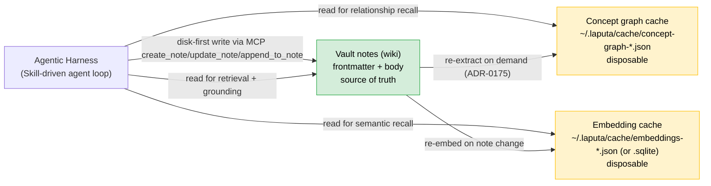
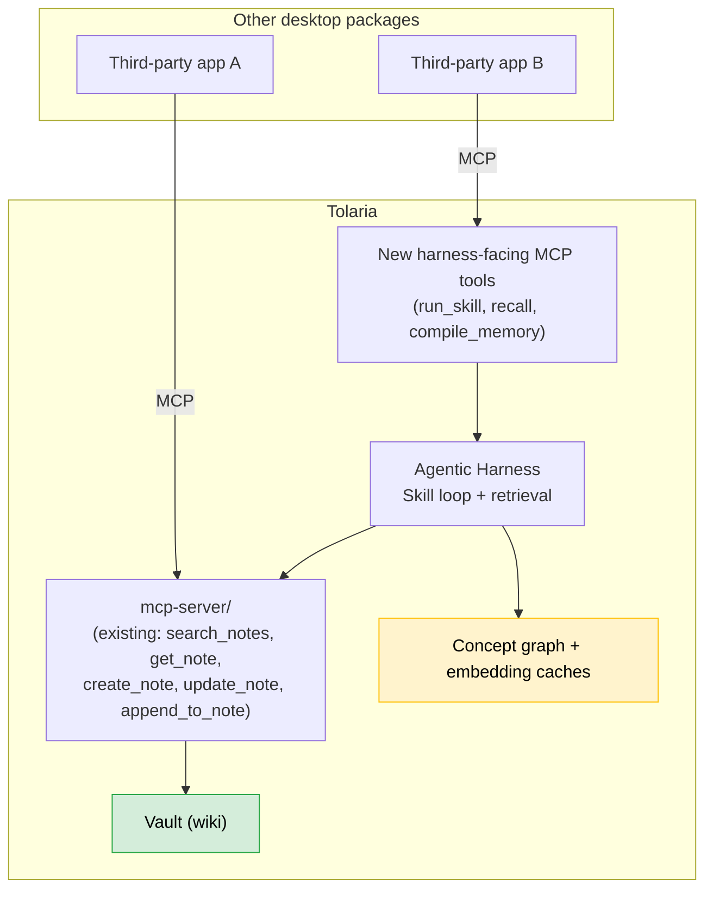

# Agentic Harness: Wiki-Backed Memory, Skills, and MCP Exposure

Status: design proposal (not yet an ADR). This document analyzes storage-format
options for an AI memory layer built on Tolaria's vault, then designs a second,
Skill-driven agentic harness that reads/writes that memory and is exposed over
MCP for use by other desktop packages. It builds directly on
[`docs/designKnowledgeGraph.md`](./designKnowledgeGraph.md) and
[ADR-0175](./adr/0175-ai-derived-concept-graph.md), and should graduate into
one or more ADRs once the recommendations in §6 have repository-owner
sign-off.

## 1. The requirement

> Keep all or most information — including agent memory — in the wiki. The
> exception is knowledge-graph/vector data, which can live in a non-wiki
> format. A second agentic harness should read/write that wiki, use a
> Skill system similar to Claude Agent Skills, and be exposed via MCP so
> other desktop packages can use it as needed.

Three sub-problems fall out of this:

1. **Where does "memory" live**, and in what format — wiki vs. non-wiki?
2. **What is the harness** that acts on that memory, and how does it differ
   from Tolaria's existing 8 CLI agent adapters?
3. **How is it exposed** so packages other than Tolaria's own `AiPanel` /
   `AiWorkspace` can call it?

## 2. Format comparison: wiki vs. non-wiki storage

Tolaria already has a wiki: the vault itself — flat markdown files with YAML
frontmatter, `type:`-based entity typing, and an explicit relationship graph
(wikilinks, `related_to:`, dynamically detected relationship fields). Per
`docs/ARCHITECTURE.md`'s "Filesystem as the single source of truth" and
"AI-first knowledge graph" principles, this is not a new decision to make —
it's the existing decision, and the only question is what else should or
should not live there.

| Candidate memory content | Wiki (markdown note) | Non-wiki (cache/index) | Verdict |
|---|---|---|---|
| Durable facts, decisions, entity profiles ("what the agent has learned about Person X, Project Y") | ✅ Human-readable, git-diffable, editable in the same UI as everything else, participates in the real relationship graph via wikilinks | ❌ Would duplicate the vault as a second source of truth — exactly what `docs/ARCHITECTURE.md` forbids | **Wiki** |
| Cross-references between compiled facts ("this decision relates to that project") | ✅ `related_to:`/custom relationship fields, resolved dynamically, already AI-navigable | — | **Wiki** |
| Concept-graph edges (LLM-extracted, probabilistic, non-authored) | ❌ Not enforceable ground truth; writing it into frontmatter would make an LLM guess look like an authored relationship | ✅ Already the ADR-0175 model: `~/.laputa/cache/concept-graph-{hash}.json`, disposable, reconstructible | **Non-wiki cache** |
| Vector embeddings for semantic search/retrieval | ❌ Binary/high-dimensional data has no sensible markdown representation and would bloat git history on every re-embed | ✅ Same disposable-cache shape as the concept graph — a new sibling cache file, not a new subsystem | **Non-wiki cache** |
| Skill definitions (reusable capability bundles) | ✅ See §4 — Skills are themselves durable, human-editable, versioned content, so they belong in the wiki, not a cache | — | **Wiki** |

The dividing line is exactly the one Tolaria already draws for the concept
graph: **if it's LLM-derived, probabilistic, and safe to delete and
regenerate, it's a cache. If it's meant to persist as knowledge — even
knowledge an agent wrote — it's vault content**, because vault content is
defined by "would a human want to read/edit/version this," not by "who
authored it." An agent-authored note is not different in kind from a
human-authored one once it's written to disk through the normal write path.

This resolves the apparent tension in the requirement: "keep memory in the
wiki, except graph/vector data" is not a new rule for Tolaria — it is the
`docs/designKnowledgeGraph.md` §3.3 rule ("never a second source of truth")
restated with "agent memory" substituted for "concept graph."

### 2.1 Why not a dedicated memory database (GBrain-style)

`docs/CompareTools.md` already evaluates a Postgres+pgvector memory engine
([GBrain](https://gbrain.homes/)) as an adjacent concept. Rejecting that
shape for Tolaria's own memory layer is deliberate, not an oversight:

- It would introduce a server process (Postgres) into what is otherwise a
  single-binary Tauri desktop app — a much heavier runtime dependency than
  the `petgraph` addition ADR-0175 already accepted.
- It re-introduces retrieve-then-synthesize RAG as the *primary* memory
  model, which is the opposite of what "keep memory in the wiki" is asking
  for — the wiki *is* the compiled, synthesized form ([Karpathy's LLM
  Wiki](https://github.com/lucasastorian/llmwiki)-style compile-once), and
  vector search should only ever be a **retrieval aid over the wiki**, not a
  replacement for it.
- Embeddings still need a store. The right-sized answer is the same shape as
  the concept-graph cache: a versioned, hash-keyed, atomically-written JSON
  or SQLite file under `~/.laputa/cache/`, holding `{note_path, chunk_id,
  vector, content_hash}` rows, rebuilt incrementally when a note's content
  hash changes. No new server process, no new runtime.

### 2.2 Vector index library comparison — LEANN vs. equivalents

[LEANN](https://github.com/StarTrail-org/LEANN) (Berkeley Sky Computing Lab,
MLsys 2026) is a genuinely notable project in this space and worth naming
explicitly here since it's the kind of thing "embedding cache" in §2.1 could
otherwise silently hand-wave past. Its core trick — **graph-based selective
recomputation**: don't store most embeddings at all, recompute them on the
fly during search over a pruned HNSW/DiskANN graph (CSR-compressed) — claims
~97% storage reduction (e.g. 201 GB → 6 GB for a 60M-document Wikipedia
index) at roughly equivalent search quality to a fully-materialized index.

| | LEANN | [LanceDB](https://github.com/lancedb/lancedb) | [sqlite-vec](https://github.com/asg017/sqlite-vec) | [usearch](https://github.com/unum-cloud/usearch) | [Qdrant](https://github.com/qdrant/qdrant) (embedded mode) |
|---|---|---|---|---|---|
| **Core trick** | Don't store most vectors — recompute on query via pruned graph | Columnar Lance file format, vectors + metadata co-located | SQLite virtual table extension, vectors as blobs | Small ANN header-lib, vectors stored as-is | Full vector-DB engine, can run in-process/local instead of server |
| **Runtime fit for Tolaria** | Python-first (CLI, MCP servers, Python embedding-provider glue) | Rust-native crate (`lancedb`), embeds directly, no subprocess | Rust bindings via `rusqlite`, embeds directly | Rust crate, embeds directly | Rust-native; "embedded" mode is still a much larger engine than needed here |
| **Storage footprint** | Best-in-class at large scale (tens of millions of vectors) | Normal (stores full vectors + metadata) | Normal (stores full vectors as blobs) | Normal | Normal, plus its own on-disk index format |
| **Query-time cost** | Higher — a query recomputes embeddings across pruned graph traversal, trading storage for compute | Low — vectors already materialized | Low | Low | Low |
| **Fits Tolaria's actual scale?** | Solves a problem sized for tens-of-millions-of-document corpora; a single personal vault's chunk count is orders of magnitude smaller, so the storage win is largely moot | Yes — designed for exactly this "one embedded process, no server" shape | Yes — smallest possible dependency footprint, closest in spirit to the existing hash-keyed JSON cache | Yes, but narrower (ANN only, no columnar metadata co-location) | Oversized — brings a full vector-database engine for a single-user local cache |
| **Violates an existing Tolaria constraint?** | Yes — `docs/designKnowledgeGraph.md` §1 already rejected a Python-runtime dependency for the concept graph ("no Python runtime exists at app runtime"); LEANN would reintroduce exactly that, either bundling a Python interpreter or shelling out to one | No | No | No | No, but adds a much larger dependency than the problem calls for |

**Recommendation: not LEANN — prefer `sqlite-vec` for v1, with LanceDB as
the fallback if richer metadata/columnar queries prove necessary.**

The reasoning is scale-mismatch plus stack-mismatch, not a quality
judgment — LEANN is a strong piece of work for what it targets (personal-AI
search over tens-of-millions-of-item corpora: full email history, browser
history, chat logs, on a laptop). Tolaria's embedding cache targets one
person's markdown vault, which for the overwhelming majority of users is
thousands, not tens of millions, of chunks. At that scale:

- LEANN's storage savings (its entire reason to exist) barely register —
  a fully-materialized embedding cache for a normal vault is already small.
- LEANN's recompute-on-query cost becomes a straight regression with no
  offsetting benefit: `recall` (§5.2) is meant to feel instant inside an
  interactive desktop app, and re-running embedding inference on every
  query adds real, avoidable latency for a storage saving nobody needed.
- LEANN's Python-first packaging (CLI + MCP servers + provider glue in
  Python) directly reintroduces the dependency `docs/designKnowledgeGraph.md`
  already ruled out for the concept graph, for the same underlying reason:
  Tolaria ships as a single Rust/Tauri binary, and every AI-adjacent Rust
  module built so far (`concept_graph/`, the CLI agent runtime) stays in
  that language on purpose.

`sqlite-vec` fits best day-to-day: it is the closest in spirit to the
existing `~/.laputa/cache/*.json` convention (one small, versioned, on-disk
file, embeddable via `rusqlite` with no subprocess), and SQLite's own
crash-safety already matches the "temp-file-then-atomic-rename" discipline
`vault/cache.rs` and `concept_graph/cache.rs` use today, without having to
hand-roll it for a bespoke JSON blob. If the harness later needs richer
per-chunk metadata or columnar filtering `sqlite-vec`'s blob-per-row model
gets awkward, `lancedb` is the fallback — still Rust-native and embedded,
just a heavier, more opinionated file format than a single cache needs to
start with.

## 3. What the harness writes, and when

The two write paths must stay distinct, matching the cache-vs-filesystem
split in §2:



The harness never writes to the graph/vector caches directly from "memory" —
those caches are only ever regenerated from vault content, same as today.
This keeps the invariant simple: **there is exactly one thing to trust
(the vault), and everything else is either a derived index over it or an
ephemeral read.**

Writing wiki memory therefore reuses infrastructure that already exists and
is already permission-gated, rather than inventing a new persistence layer:
the same `create_note` / `update_note` / `append_to_note` MCP tools
(`mcp-server/index.js`) that CLI coding agents use today, and the same
disk-first-write invariant from `docs/ARCHITECTURE.md` §"Three
representations, one authority."

## 4. Skills subsystem

A Skill (in the Claude Agent Skills sense: a packaged, discoverable,
on-demand capability bundle — typically a `SKILL.md` with frontmatter
metadata plus instructions, optionally with bundled scripts/resources) needs
a storage location. Two options were considered:

| Option | Description | Assessment |
|---|---|---|
| Filesystem convention outside the vault (e.g. `.tolaria/skills/*.md`, mirroring `.claude/skills/`) | Skills live beside the vault, not in it | Breaks "AI-first knowledge graph": skills become invisible to the sidebar, search, wikilinks, and the Neighborhood view. Also a second, parallel markdown-with-frontmatter convention outside the one Tolaria already has. |
| **A new `type: Skill` Type**, stored as ordinary vault notes at the vault root (`docs/ABSTRACTIONS.md` "Types as Files") | Skills are vault notes like any other type — `weekly-review-skill.md` with `type: Skill` | **Recommended.** Reuses the existing Type-document machinery verbatim: sidebar section, icon/color, Instances list, Properties panel, git history, wikilink-addressability from other notes ("this Project `related_to: [[my-skill]]`"). No new subsystem. |

### 4.1 Skill note shape

```yaml
---
type: Skill
title: Weekly Essay Draft
icon: pencil-simple
_trigger_keywords:
  - weekly essay
  - draft newsletter
_tools_allowed:
  - search_notes
  - get_note
  - append_to_note
---
# Weekly Essay Draft

Use when the user asks to draft this week's newsletter essay.

1. Search the vault for notes tagged `type: Topic` modified in the last 7 days.
2. ...
```

- `type: Skill` makes it a first-class Tolaria entity — visible, editable,
  git-versioned, just like a `Procedure` or `Person` note.
- `_trigger_keywords` and `_tools_allowed` follow the underscore
  system-property convention (`docs/ABSTRACTIONS.md` "System Properties"):
  hidden from the normal Properties UI, but readable by the harness and
  editable in raw mode by power users.
- The Markdown body *is* the Skill's instructions — exactly the same
  authoring surface as every other note, so no new editor or format is
  needed to write or edit a Skill.
- This is a closer fit for "Skill" as Claude Agent Skills defines it than a
  bare instructions-only file would be: a Skill can `related_to:` the
  Projects/Procedures it applies to, participates in Neighborhood
  navigation, and is discoverable by the same search the harness uses for
  everything else.

### 4.2 Discovery and invocation

The harness discovers Skills by querying vault entries with `type: Skill`
(the same `VaultEntry` filtering every other Type-driven feature uses — no
new index). At the start of a task, the harness:

1. Lists all `type: Skill` notes (cheap — already in the in-memory
   `VaultEntry[]` graph, no extra I/O).
2. Matches `_trigger_keywords` against the task, or lets the model itself
   pick a Skill by title + description the same way Claude Agent Skills
   resolves skills at runtime — either strategy is a policy choice for the
   harness's loop, not a storage-format decision.
3. Loads the matched Skill note's body as an instruction block, and honors
   `_tools_allowed` as a tool allowlist for that turn — the same
   Safe/Power-User-style scoping principle `ai_agents.rs` already applies
   per adapter, just applied per-Skill instead of per-adapter.

## 5. The harness itself

### 5.1 Why a second harness, not a ninth CLI adapter

Tolaria's existing AI system (`docs/ARCHITECTURE.md` "AI System") is 8
general-purpose coding-agent adapters (Claude Code, Codex, Copilot, OpenCode,
Pi, Antigravity, Kiro, Hermes) spawned as ephemeral subprocesses when a human
opens `AiPanel`/`AiWorkspace`. That model is deliberately **stateless between
turns beyond the conversation itself** and **user-invoked, never standing**
(see `docs/CompareTools.md`'s Cabinet comparison — Tolaria's agents are
ephemeral by design, not standing/scheduled).

The harness this document proposes is a different kind of consumer:

- It is **memory-first**: its job is reading and compiling wiki content
  (Skill-driven retrieval + synthesis), not general-purpose coding.
- It needs to be **callable by processes other than Tolaria's own UI** —
  the stated goal is "expose it via MCP to use other desktop packages based
  on need," i.e. a third-party app, not just `AiPanel`.
- It is **Skill-scoped rather than tool-scoped** — its unit of capability is
  a Skill note (§4), not a fixed adapter-level tool list.

This mirrors the [DeepSeek Harness](https://github.com/deepseek-ai/deepseek-harness)
vs. [Cabinet](https://github.com/cabinetai/cabinet) distinction already
recorded in `docs/CompareTools.md`: a general "everything is a plugin" agent
framework (what the 8 CLI adapters already give Tolaria, at the coding-agent
layer) versus a narrower, opinionated harness purpose-built for one job
(here: wiki-backed memory + Skills), the same way Cabinet is a narrower,
opinionated product built on top of general CLI-agent adapters.

### 5.2 Architecture



Key design choice: **the harness is itself an MCP *server* consumer and an
MCP *tool* provider at the same time.** It calls the existing
`mcp-server/index.js` tools to read/write the wiki (no new vault-access code
path — reuses the active-vault boundary checks already enforced there), and
it registers a small number of *new* tools on that same MCP surface for
external callers:

| New tool | Purpose |
|---|---|
| `run_skill` | Given a Skill name/id and a task, runs the Skill's instructions against the current vault and returns a result — the harness's primary entry point |
| `recall` | Semantic + graph-aware retrieval: hybrid of vault full-text search (`search_notes`), the embedding cache (§2.1), and the concept graph cache (ADR-0175), returned as ranked note references, not raw vector output |
| `compile_memory` | Explicit, user/caller-triggered action that asks the harness to write or update a wiki note from new source material — the compile-once step, never a background task, matching the ADR-0175 precedent that AI writes are always explicitly triggered |

`compile_memory` is intentionally the only tool that writes. It goes through
the same `create_note`/`update_note` tools the harness itself calls
internally — there is no separate "harness write path," only the existing
one, called one layer deeper.

### 5.3 Reuse from the existing AI system

The harness should not reimplement subprocess lifecycle, streaming, or
permission-mode plumbing — `cli_agent_runtime.rs` already owns "the common
request shape, prompt wrapping, JSON-line and line-oriented subprocess
lifecycle... normalized error/done handling" for every adapter. If the
harness is itself implemented as a CLI-invokable process (e.g. it wraps one
of the 8 existing adapters with a Skill-aware system prompt and a narrower
MCP tool list), it is simply a 9th adapter-shaped consumer of that scaffold,
configured with:

- A system prompt assembled from the matched Skill's body (§4.2) instead of
  the general Tolaria docs-orientation prompt.
- `_tools_allowed` from the Skill note mapped onto the same
  Safe/Power-User-style tool scoping `ai_agents.rs` already does per adapter.
- MCP config pointing at the existing bridge (`ws://9710`/`9711` per
  `docs/ARCHITECTURE.md`'s System Overview), so it is a peer of the CLI
  agents from Tolaria's own vault-access boundary's point of view — not a
  privileged bypass.

This keeps the harness additive: no new permission model, no new subprocess
runtime, no new vault-access boundary — only a new prompt-assembly and
tool-allowlist policy layered on infrastructure ADR-0175 and the AI System
section already built and tested.

### 5.4 Recall pipeline design, informed by Cortex RAG

[Cortex RAG](https://github.com/SaiAkhil066/CORTEX-AI-SUPER-RAG) is a
Streamlit app for local, Ollama-backed document Q&A that is worth reviewing
here for the same reason LEANN was in §2.2: not as something to embed
directly, but because its retrieval *architecture* is a close, validated
match for what `recall` (§5.2) already needs to become, and it makes several
design choices concrete that the current draft leaves vague.

**What it does, structurally:** three parallel indexes over uploaded
documents — BM25 (sparse/keyword), FAISS (dense/vector), and a NetworkX
knowledge graph (entity/relation) — merged through **RAG-Fusion** (multiple
LLM-generated query variants, retrieved independently, combined via
Reciprocal Rank Fusion), then refined through a cross-encoder reranker and
an LLM relevance-grading pass (**Corrective RAG**), with a cosine-similarity
**semantic cache** short-circuiting repeat questions before any of that runs.
Every chunk is also enriched with LLM-written **situating context** before
indexing, so an isolated fragment still carries document-level meaning.

**The three-index shape validates the recall design almost exactly.**
Tolaria already has, or is already designing, all three legs: `search_notes`
(sparse/keyword, BM25's role), the embedding cache from §2.1/§2.2 (dense
vector, FAISS's role), and the ADR-0175 concept graph (`petgraph`,
NetworkX's role). `recall`'s current spec — "hybrid... returned as ranked
note references" — is directionally right but doesn't say *how* the three
rankings combine. Cortex RAG's answer is a good one to just adopt:

- **Recommend: use Reciprocal Rank Fusion (RRF) to merge the three ranked
  lists inside `recall`.** RRF is simple (no learned weights, no tuning), and
  it composes cleanly with what `recall` already returns (ranked note
  references, not raw scores). This resolves an ambiguity the original
  design left open, not a new capability.
- **Recommend: adopt Contextual Retrieval at embedding-*build*-time, not
  query time.** Prepending a short, LLM-written situating note to each chunk
  before embedding it is a compile-once cost, the same shape as concept-graph
  extraction and Skill matching — an explicit, user-triggered indexing step,
  never a per-query cost. It's a particularly good fit for Tolaria's own
  chunking (`concept_graph/chunking.rs`, heading-bounded sections): a short
  heading-level fragment loses more surrounding meaning than a full-document
  chunk does, so the enrichment matters more here than in Cortex RAG's
  whole-PDF chunking, not less.
- **Recommend: keep cross-encoder reranking and CRAG-style grading out of
  `recall` itself, at least for v1.** Both require inference — a cross-
  encoder call, or a full LLM grading pass — and §6.1 already commits
  `recall` to being the one tool in this design that needs no LLM call and
  can run without the app open. Adding either inside `recall` breaks that
  property for a precision gain that `run_skill`'s own agent turn can
  capture for free: the Skill-invoked agent already looks at `recall`'s
  candidate notes as part of its own reasoning, which *is* a relevance-
  grading pass, just one that doesn't need a second, separate model call.
  If reranking is added later, it belongs as a v2 enhancement to `recall`
  using a small local ONNX cross-encoder (matching the local-only-by-default
  posture in §6.2) — evaluated on its own, once basic RRF fusion has shipped
  and proven insufficient, per the rollout ordering in §6.5.
- **Recommend: adopt the semantic cache, but key it by vault content-
  fingerprint, not raw question-similarity alone.** A 0.92-cosine repeat-
  question cache is a good idea for `run_skill`, where it sits in front of
  an actual model call worth avoiding — but caching purely on question
  similarity risks returning a stale answer once `compile_memory` (§6.4) has
  changed the underlying wiki content. Follow the same discipline every
  other cache in this design already uses (ADR-0175's cache, §2.1's
  embedding cache): key the semantic cache entry by
  `(skill_id, query_embedding, vault_content_fingerprint)`, so a wiki change
  invalidates it automatically instead of relying on a human to notice a
  stale cached answer.

**What not to take from it: the stack.** Cortex RAG is Streamlit + Python +
Ollama end-to-end — the same stack-mismatch already flagged for LEANN in
§2.2. It's a fine architecture reference, not a dependency to embed; every
piece above is being adopted as a *design pattern* (RRF merge, compile-time
contextual enrichment, cache keyed for invalidation), reimplemented in
Rust/Node against Tolaria's own indexes, not as an integrated library or
subprocess.

## 6. Resolved recommendations

These were open questions in an earlier draft; each now has a recommended
answer so this doc can graduate toward an ADR. None are implemented yet —
these are the positions to implement *against*.

### 6.1 Where does the harness run?

**Split by whether the tool needs inference, rather than picking one runtime
for all three new tools.**

- `recall` needs no LLM call — it only reads the concept-graph cache and a
  new embedding cache, both plain files under `~/.laputa/cache/`. Implement
  it directly in `mcp-server/` (Node), reading those cache files the same
  way `vault.js` already reads notes directly from disk. This means `recall`
  works even when the Tauri app isn't running, matching how `search_notes`/
  `get_note` behave today.
- `run_skill` and `compile_memory` need real inference — matching a Skill,
  assembling a prompt, and spawning a CLI agent. That logic already exists
  exactly once, correctly, in `cli_agent_runtime.rs`/`ai_agents.rs`; do not
  reimplement agent-spawning a second time in Node. Implement the
  matching/prompt-assembly/invocation as a Rust module
  (`src-tauri/src/agentic_harness/`), shaped like `concept_graph/`, reusing
  `run_ai_agent_stream` the same way `CliAgentExtractor` already does. The
  Node-side `run_skill`/`compile_memory` tools proxy through the existing WS
  bridge (`ws://9710`/`9711`) into the running app.
- Consequence, stated plainly rather than left implicit: `run_skill` and
  `compile_memory` require Tolaria to be open; `recall` does not. This is an
  honest constraint that falls out of "reuse the one real agent-invocation
  implementation," not a workaround to route around later.

### 6.2 Embedding model choice

**Local-only by default; no new mandatory network dependency.**

Tolaria's existing search (`search.rs`) is pure local keyword search — no
note content leaves the device unless a user explicitly opens an AI panel.
Embeddings should preserve that default: a small local embedding model as
the default tier, with an optional API-embedding upgrade reusing the same
installation-local credential storage `ai_agents.rs` already has for
provider keys (never vault-stored, per the vault-vs-settings rule in
`ARCHITECTURE.md`). This is a separate axis from the *index/storage* choice
in §2.2 (`sqlite-vec` over LEANN): §2.2 decides where vectors live once
computed, this decides what computes them. `recall` must degrade to keyword
search when no embedding provider is configured, never hard-fail — the same
"degrade
gracefully" consequence ADR-0175 already commits to for the concept graph.

### 6.3 Skill conflict/versioning

**Deterministic resolution; reject ambiguity instead of silently guessing.**

1. Exactly one `type: Skill` note matches the trigger keywords → use it.
2. Multiple match → prefer the most specific (highest keyword-overlap)
   match, deterministically — no model call needed for this step.
3. Still tied → surface the candidates and stop, rather than picking one.
   Tolaria already takes this position elsewhere: a manually typed ambiguous
   vault slug is rejected rather than guessed for Tolaria Deep Links
   (`docs/ABSTRACTIONS.md`). Same failure mode, applied to Skill matching.

Versioning needs no new mechanism: Skills are ordinary vault notes, so git
history already is the version history.

### 6.4 `compile_memory` merge semantics — the highest-risk item

**v1 never auto-writes. It proposes a change; a human or the calling agent
explicitly accepts it before anything reaches disk.**

This is the one recommendation held firmly rather than offered as a
default-until-evidence: reuse ADR-0175's posture verbatim — "extraction is
always an explicit, user-triggered action... never a background task."
`compile_memory` returns a proposed diff; it does not commit one. For
contradiction-flagging specifically, reuse a mechanism Tolaria's editor
already has rather than inventing UI: Obsidian-style callout blocks
(`> [!warning]`, `docs/ARCHITECTURE.md` "Editor"). When merging new source
material conflicts with an existing wiki page's content, the proposed
compiled note surfaces that conflict as a callout, visible in the normal
editor. Automatic, non-reviewed writes stay out of scope until there is real
usage evidence that the review step is a friction point worth removing, and
even then only behind an explicit opt-in setting — this is not a "v2 removes
the safety rail by default" plan.

### 6.5 Rollout ordering

Ship in increasing order of risk and blast radius:

1. **`recall`** — read-only, works without the app open, lowest risk.
2. **`run_skill`**, scoped first to read-only Skills (no `_tools_allowed`
   entries that write).
3. **`compile_memory`** — last, and only once the review-before-write flow
   from §6.4 is solid.

This also lets the CodeScene/Codacy/localization gates in `AGENTS.md` §1
apply incrementally per tool, rather than as one large, harder-to-review
change.

## 7. Summary

- **Memory lives in the wiki** (Tolaria's existing vault) because that is
  already Tolaria's filesystem-as-truth model — no new decision needed.
- **Graph and vector data stay non-wiki**, as disposable, reconstructible
  caches — extending the exact pattern ADR-0175 already established for the
  concept graph, not inventing a new one.
- **Skills are vault notes** (`type: Skill`), not a separate file convention,
  so they inherit sidebar visibility, git history, and wikilink
  addressability for free.
- **The harness is a Skill-scoped, memory-first peer of the existing 8 CLI
  adapters**, reusing `cli_agent_runtime.rs` plumbing and the existing MCP
  vault-access boundary rather than building a parallel one.
- **MCP exposure is additive**: a small number of new tools
  (`run_skill`, `recall`, `compile_memory`) registered alongside the
  existing `search_notes`/`get_note`/`create_note`/`update_note`/
  `append_to_note` tools, so any MCP-capable external app gets the same
  capability surface Tolaria's own AI system uses internally.
