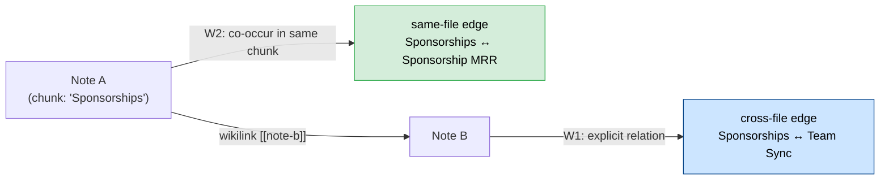

# Concept Graph: Design & Implementation

Status: implemented (ADR-0175). This document explains where the idea came
from, what we kept vs. changed, and how the Tolaria implementation actually
works end to end. §7 records a second downstream adaptation of this same
design, into DeepSeek Harness's `dsh-plugins/knowledge-hub` plugin
(2026-08-19–27) — what carried over, what changed, and one capability
(opt-in per-query graph expansion) that design added beyond what's
documented here.

## 1. The original design: rahulnyk/knowledge_graph

[rahulnyk/knowledge_graph](https://github.com/rahulnyk/knowledge_graph) turns
a text corpus into an interactive knowledge graph for Graph-RAG and
knowledge-based Q&A. Its pipeline, run from a single Jupyter notebook
(`extract_graph.ipynb`):

1. **Input**: PDF documents, split into fixed-size text chunks with assigned
   chunk IDs (page-based chunking, since PDFs have no other structural
   boundary).
2. **Concept extraction**: a local LLM (Mistral 7B OpenOrca via Ollama, chosen
   to avoid API costs) reads each chunk and extracts *concepts* — short noun
   phrases like "pleasant weather in Bangalore" — rather than doing Named
   Entity Recognition. It also proposes relationships between concepts found
   in the same chunk.
3. **Edge weighting**: two signals combine into edge weight — **W1**, the
   LLM's own asserted relationship between two concepts, and **W2**,
   contextual proximity (concepts that simply co-occur in the same chunk get
   a relationship too, even if the LLM didn't state one explicitly).
4. **Consolidation**: duplicate concept pairs across chunks are merged —
   weights summed, relation labels concatenated — using pandas/NetworkX
   groupby-style aggregation.
5. **Graph metrics**: NetworkX computes degree centrality and runs community
   detection (Louvain-style) so nodes can be sized and colored meaningfully.
6. **Visualization**: Pyvis renders the graph as an interactive, force-directed
   HTML page — a dark canvas with clustered coloring, node size by degree, and
   draggable nodes — exportable and hostable as a static site.

The result is compelling (see the reference screenshot in the original
conversation: a dense, clustered graph of health-policy concepts), but the
stack is Python-first: Jupyter for orchestration, pandas for the edge table,
NetworkX for graph algorithms, Pyvis for rendering, and Ollama for local
inference. None of that exists in Tolaria, and none of it fits Tolaria's
"filesystem as single source of truth" / disposable-cache architecture without
translation.

## 2. What we adopted, what we changed, and why

| Source project | Tolaria's concept graph | Why |
|---|---|---|
| PDF, chunked by page | Markdown notes, chunked by heading section | Notes are already file-bounded; page-style chunking solves a problem Tolaria doesn't have |
| Jupyter notebook orchestration | A Rust module (`src-tauri/src/concept_graph/`) behind a Tauri command | No Python runtime at app runtime; matches how every other Tolaria feature is implemented |
| Local Ollama LLM call, hand-written | `CliAgentExtractor`, reusing `ai_agents::run_ai_agent_stream` | Tolaria already has 8 CLI agent adapters (Claude Code, Codex, Copilot, OpenCode, Pi, Antigravity, Kiro, Hermes) wired with Safe/Power-User permission modes — extraction is one more consumer of that existing plumbing, not a new AI integration |
| pandas/NetworkX edge aggregation | Plain Rust `HashMap`-based consolidation + `petgraph::unionfind::UnionFind` | Same W1/W2 idea, but W1 (explicit) and W2 (proximity) map cleanly onto two *real* Tolaria signals — wikilinks and same-chunk co-occurrence — described in §3 |
| NetworkX community detection (Louvain) | Connected components via `petgraph`'s union-find | A fast, deterministic stand-in adopted deliberately for v1; documented in the ADR as a placeholder to revisit if a vault's graph outgrows it |
| Pyvis HTML export | `ConceptGraphView` React component, hand-rolled Canvas 2D force simulation | Validated in a proof-of-concept that a small hand-rolled simulation (repulsion + weighted springs + centering, no external library) renders a legible graph at the scale a single vault reaches — so no `d3-force`/`cytoscape`/`sigma` dependency was added |
| One graph, whole corpus, no filtering | Same-file / cross-file scope toggle + per-note checklist | Added mid-design at the user's request: "I want to be able to relate to concepts within the same markdown and also across markdown files... I should be able to select or unselect certain markdown files." This became a schema-level feature, not just a UI filter (§3) |
| Graph is the artifact (exported, hosted) | Graph is a disposable cache (`~/.laputa/cache/concept-graph-*.json`) | Matches Tolaria's "three representations, one authority" principle: filesystem is truth, everything derived is reconstructible and never a second source of truth |

The single most important adaptation is **not** the language rewrite — it's
recognizing that Tolaria already has two things the source project has to
build from scratch: a *file-bounded* corpus (no arbitrary chunking needed) and
an *existing* explicit link graph (wikilinks) that can supply real,
deterministic cross-document edges instead of relying entirely on LLM
inference.

## 3. Our design, in detail

### 3.1 Two edge types, not one

The source project's W1 (LLM-asserted) and W2 (proximity) weights are both
*probabilistic* — a Mistral 7B call decides both. In Tolaria's design these
became two structurally different signals:

- **W2 — contextual proximity.** Concepts extracted from the *same chunk*
  (i.e., the same heading section of the same note) get an edge. Because a
  chunk never spans more than one note, this edge is **same-file by
  construction** — no extra bookkeeping needed to know its scope.
- **W1 — explicit relation.** Derived from real wikilinks (`[[target]]`)
  found in a note's chunks, connecting that note's *primary concept* (its
  title) to the linked note's primary concept. Because a wikilink points from
  one note to another, this edge is **cross-file whenever the two notes
  differ** — again, the scope falls out of the data rather than being a
  separate classification step.

Every `ConceptEdge` carries the full set of contributing note paths
(`note_ids`), and `scope` (`same-file` / `cross-file`) is derived from
`note_ids.len() > 1`. This is why the same-file/cross-file toggle the user
asked for didn't need new extraction logic — it was already latent in how the
two edge types are produced.

### 3.2 Per-note scope, not just a display filter

The file checklist is not a client-side visual filter layered on top of one
fixed extraction. It changes what gets **extracted and cached**:

- `extract_concept_graph(vault_path, note_paths, agent)` only chunks and
  extracts the notes named in `note_paths` (or every markdown note if
  `None`).
- A wikilink pointing to a note *outside* that scope is treated exactly like
  a wikilink to a note that doesn't exist — silently ignored, not an error.
- The cache is keyed by a `scope_fingerprint` (an order-independent hash of
  the requested note paths), so selecting a different subset of notes never
  serves a stale graph built from a different selection.

The frontend's scope toggle (All / Same file / Cross file) is a second,
purely client-side filter *on top of* whatever graph was actually extracted —
it recomputes visible nodes/edges and each node's live degree from the
currently selected files and scope, without re-invoking the AI agent. Only
clicking "Re-extract" re-runs extraction, scoped to the checklist's current
selection.

### 3.3 Never a second source of truth

Tolaria's `docs/ARCHITECTURE.md` describes three representations of vault
data — filesystem, cache, React state — with the filesystem always
authoritative and the cache always disposable and reconstructible. The concept
graph is designed as a **fourth representation that is a peer of the cache
tier, not the filesystem tier**:

- Stored at `~/.laputa/cache/concept-graph-{vault-hash}.json`, versioned
  (`CONCEPT_GRAPH_CACHE_VERSION`), written via temp-file-then-atomic-rename —
  the same lifecycle shape as `vault/cache.rs`, but a small, independent
  implementation rather than new surface added to that already-large file.
- Never written back into note frontmatter or bodies. LLM extraction is not
  enforceable ground truth, so it cannot become part of the explicit
  relationship graph automatically.
- Deleting the cache file is always harmless — the next request simply
  re-extracts.
- Extraction is always an explicit, user-triggered action (opening the panel
  and clicking "Extract Concept Graph" / "Re-extract"), never a background or
  startup task, so opening a vault never silently spawns AI agent calls.

### 3.4 Visual design

Node color follows a fixed, validated categorical palette (8 hues, checked
against CVD-separation and contrast requirements via the repo's dataviz
validator, for both light and dark themes) rather than an improvised color
scheme; a community beyond the 8th slot folds into a neutral "Other" gray
instead of generating a new hue. Node size follows true graph degree
(recomputed live from whichever edges are currently visible under the
active file/scope filters) — not how many chunks mentioned the concept, which
was an early bug the Rust test suite (`node_degree_counts_edges_not_chunk_occurrences`)
exists specifically to catch. Cross-file edges render dashed and fainter than
same-file edges so the distinction reads visually, not just through the
toggle state.

## 4. How we implemented it

### 4.1 Backend — `src-tauri/src/concept_graph/`

| File | Responsibility |
|---|---|
| `types.rs` | `ConceptNode`, `ConceptEdge`, `EdgeScope`, `ConceptGraph` — the serialized shape returned to the frontend |
| `chunking.rs` | Strips frontmatter, splits a note's body into heading-bounded chunks |
| `links.rs` | Extracts `[[target]]` / `[[target\|alias]]` / `[[target#heading]]` wikilink targets from a chunk (deterministic, no LLM) |
| `resolve.rs` | Resolves a wikilink target string to an in-scope note's vault-relative path, by filename stem or title |
| `extraction.rs` | The `ConceptExtractor` trait; `CliAgentExtractor` (production, calls `ai_agents::run_ai_agent_stream` in Safe mode with a fixed JSON-only extraction prompt); tests use a `FakeExtractor` so extraction-independent logic stays fast and deterministic |
| `graph.rs` | Consolidates per-note extractions into a graph: W2/W1 edge construction, true degree centrality, connected-components clustering via `petgraph::unionfind::UnionFind` |
| `cache.rs` | Disk cache: version, scope fingerprint, atomic temp-file-then-rename writes |
| `mod.rs` | Orchestrates the pipeline (`extract_concept_graph`) and the cache-aware entry point (`get_or_extract_concept_graph`) |

Exposed as the `extract_concept_graph` Tauri command
(`src-tauri/src/commands/concept_graph.rs`), taking
`{ vault_path, note_paths: Option<Vec<String>>, agent: AiAgentId }` and
returning a `ConceptGraph`. Runs on the blocking Tokio pool via
`spawn_blocking`, matching the pattern used by other scan-heavy commands.

37 unit and integration tests cover chunking edge cases (frontmatter-only
notes, headingless notes), wikilink extraction (aliases, heading anchors,
dangling brackets), graph consolidation (same-file vs. cross-file
classification, weight summation, out-of-scope wikilinks, degree-vs-occurrence
correctness, community separation), cache round-tripping (scope-fingerprint
misses, version staleness), and one full pipeline test that writes real notes
to a temp directory and asserts a wikilink between them produces a cross-file
edge.

### 4.2 Frontend — `src/components/ConceptGraphView.tsx`

A rail (relationship-scope `Tabs`, per-note `Checkbox` list, extract/re-extract
`Button`) beside a canvas panel. The canvas owns:

- A small hand-rolled force simulation (`SimPoint` per node: position,
  velocity, pinned flag) — repulsion, weighted springs along edges, centering,
  velocity damping, run on `requestAnimationFrame` and cooled via an alpha
  decay, matching the qualitative behavior of d3-force without the
  dependency.
- Pan (drag), zoom (wheel), and per-node drag-to-pin, implemented directly on
  canvas mouse events.
- A hover tooltip showing degree, cluster, and originating note paths; a
  click-without-drag opens the node's first originating note via
  `onOpenNote`.

`src/utils/conceptGraph.ts` wraps the Tauri `invoke` call (fields deliberately
kept snake_case at the IPC boundary, matching the Rust request struct exactly,
consistent with how `stream_ai_agent` and every other Tolaria command
request/response shape crosses that boundary). A mock handler in
`src/mock-tauri/mock-handlers.ts` returns a small representative graph for
browser-mode development.

Wired into `App.tsx` as a new `SidebarFilter` variant (`'conceptGraph'`),
rendered in the same `app__note-list` slot `PulseView` uses (resizable wider
if the graph needs more room), and reachable via the command palette
("Go to Concept Graph"). English UI strings live under the `conceptGraph.*`
namespace in `src/lib/locales/en.json`.

9 frontend tests cover: the empty state not auto-extracting, extraction
reporting correct counts, the cross-file scope toggle hiding an edge while
keeping its endpoints visible as isolated concepts (scope filters edges, not
node membership), file deselection excluding a note and any edge it
contributed to, re-extraction respecting the current checklist selection, and
the error state's retry action.

### 4.3 Proof of concept that validated the design before the real build

Before writing the Rust module, a standalone Node script
(`concept_graph_poc.mjs`, not committed) ran the same pipeline shape — chunk,
mock-extract, consolidate, tag same-file/cross-file — over real
`demo-vault-v2` notes (the sponsorship/business workstream: `area-building.md`,
`responsibility-sponsorships.md`, `measure-sponsorship-mrr.md`,
`procedure-*.md`, `person-*.md`, plus a separate writing-topic cluster) and
produced a real graph JSON, which drove an interactive Canvas viewer artifact
matching the reference project's visual language (dark canvas, clustered
coloring, curved edges, draggable nodes). This caught the
degree-vs-occurrence bug and validated the W1/W2 same-file/cross-file split
before either was ported to Rust.

## 5. Known limitations / follow-ups

- **Community detection is connected components, not Louvain.** Fine for
  small-to-medium graphs; revisit with a proper label-propagation or Louvain
  implementation if a vault's concept graph grows large enough that
  components alone stop producing useful clusters.
- **Wikilink resolution is filename-stem/title matching, not full alias
  resolution.** It does not yet consult a note's `aliases:` frontmatter the
  way the rest of Tolaria's wikilink navigation does. If a shared backend
  wikilink resolver is ever extracted, `resolve.rs` should call it instead of
  duplicating matching logic.
- **Localization is incomplete.** The 20 `conceptGraph.*` keys exist only in
  `en.json` — `pnpm l10n:translate` requires `LARA_ACCESS_KEY_ID`/
  `LARA_ACCESS_KEY_SECRET`, unavailable in the environment this was built in.
  `pnpm l10n:validate` currently fails for all 20 target locales until this
  is run.
- **CodeScene/Codacy gates were not run** — neither MCP tool was connected in
  the build environment. `cargo clippy` and `pnpm lint` were run instead as a
  compensating check on all touched/new files.

## 6. Comparison to Obsidian's Smart Connections plugin

Structurally these solve a similar problem — "what else in my vault relates
to this" — but they're different technologies underneath, not competing
implementations of the same idea.

| | Tolaria's Concept Graph (ADR-0175) | Smart Connections |
|---|---|---|
| **Underlying method** | LLM extraction: chunks each note by heading, asks an agent to name the concepts in the excerpt, infers relations from that + real wikilinks | Embeddings: generates a vector per note/block (local model via transformers.js, or an API embedding model) and ranks by cosine similarity |
| **What the "nodes" are** | Extracted **concepts** (short noun phrases) — not the notes themselves | The **notes/blocks** themselves — there's no abstraction layer above the note |
| **What you see** | A whole-graph force-directed canvas (`ConceptGraphView.tsx`) — clustered, colored by community, sized by degree, pan/zoom/drag | A ranked sidebar list of "most similar notes" to whatever note is currently open |
| **Relationship semantics** | Two typed edges: same-chunk proximity (same-file) and LLM/wikilink-asserted relations (cross-file), each edge keeps its contributing note paths as provenance | A single similarity score (0–1) per pair — no explanation of *why*, just "how close" |
| **Update model** | Explicit, user-triggered only ("Extract"/"Re-extract" button) — the ADR deliberately rules out background extraction to avoid silently spawning AI agent calls on every vault open | Continuous/incremental — recomputes embeddings as you edit, no button to press |
| **Cost per run** | One agent call per non-empty note chunk — real LLM inference cost, proportional to vault size, which is exactly why it's scoped (per-note checklist) and cached rather than automatic | Cheap, local, near-instant — embedding models are lightweight enough to run continuously in the background |
| **Cache** | Versioned JSON at `~/.laputa/cache/concept-graph-{hash}.json` — human-inspectable nodes/edges/scope, safe to delete anytime | Vector store, not human-readable, incrementally maintained |
| **Vault Q&A / chat** | Not part of this feature at all — Tolaria's separate AI Workspace handles agent chat | Smart Connections ships "Smart Chat" alongside it, doing RAG-style Q&A over the same embeddings |

The practical difference that matters most: Smart Connections answers *"which
existing notes are semantically similar to this one"* — good for surfacing
related notes you forgot you wrote, cheap enough to run on every keystroke.
Tolaria's concept graph answers a different question — *"what concepts live
inside my notes, and how do they connect to each other"* — it can surface a
concept that spans five notes none of which directly link to each other,
something a note-to-note similarity ranking structurally can't do, because
Smart Connections never breaks a note down into its constituent ideas.

The tradeoff is the ADR states outright (`docs/adr/0175-ai-derived-concept-graph.md`
Consequences section): concept extraction is LLM-cost-proportional and
explicitly not automatic, whereas embedding similarity is cheap enough to be
ambient. They're complementary rather than substitutes — a vault could
reasonably want both.

This comparison reflects Smart Connections' general architecture as commonly
documented; it has not been re-verified against the plugin's current
README/changelog, so treat specific version-level claims (e.g. its exact
clustering features) as approximate rather than current-release-accurate.

## 7. A second downstream adaptation: DeepSeek Harness's knowledge-hub plugin (2026-08-19–27)

This design (§1–§6) was itself adapted a second time — into
`dsh-plugins/knowledge-hub/`'s opt-in concept graph, part of DeepSeek
Harness (DSH), a Node.js/Cordis-plugin agent runtime, unrelated to Tolaria's
Rust/Tauri desktop app except by way of this shared design. Full rationale
for *why* DSH wanted a concept graph at all lives in
[`docs/designCognitiveBrainForDSH.md`](./designCognitiveBrainForDSH.md) §4;
this section records how that second implementation relates to the one
documented above — what carried over unchanged, what changed and why, and
one genuinely new capability this design didn't have.

### 7.1 What carried over unchanged (in concept, not in code — no shared runtime exists)

| This design (Tolaria, Rust/Tauri) | DSH's version (`dsh-plugins/knowledge-hub/src/`) |
|---|---|
| Two edge types: W2 same-chunk proximity (always same-file), W1 explicit relation from wikilinks (§3.1) | Identical split, same names, in `concept-graph.ts` — `ConceptEdge.scope: 'same-file' \| 'cross-file'`, derived from `noteIds.length > 1` the same way |
| Chunking by heading section, since notes are already file-bounded (§2 row 1) | Identical: `chunking.ts`'s `chunkByHeading()` splits on `##`/`###` |
| Never a second source of truth — disposable, versioned JSON cache (§3.3) | Identical in spirit: `.concept-graph.json` in the vault directory, `CONCEPT_GRAPH_CACHE_VERSION`, safe to delete anytime, written via `writeFileAtomic` (this repo's equivalent of Tolaria's temp-file-then-rename) |
| Community detection via `petgraph`'s union-find connected-components, not Louvain — "fine for small-to-medium graphs" (§2 row 5, §5) | Identical simplification, same justification, in `concept-graph.ts`'s `recomputeDegreeAndCommunity()` — and reused a second time inside the same plugin for an unrelated purpose (§7.4) |
| Extraction always explicit/user-triggered, never background/startup (§3.3) — "opening a vault never silently spawns AI agent calls" | Same principle, different mechanism: DSH's trigger is `memory_remember` itself (§7.2), never a background timer or plugin-boot scan |
| Hand-rolled Canvas2D force simulation — repulsion, weighted springs, centering — deliberately no `d3-force`/`cytoscape` dependency (§3.4, §4.2) | Identical choice, `web/concept-graph-page.ts` — validated at "real vault scale" the same way this design's proof-of-concept validated it (§4.3) before either was built |
| Node color/size following true graph degree, not chunk-occurrence count (§3.4, the `node_degree_counts_edges_not_chunk_occurrences` regression test) | Same correctness property maintained in `concept-graph.ts`'s degree computation (counts edges, not `noteIds` length) |

### 7.2 What changed, and why

- **Extraction trigger: per-note-write, not per-button-click.** This
  design's `extract_concept_graph`/`get_or_extract_concept_graph` runs over
  a user-selected file scope on an explicit "Extract"/"Re-extract" click
  (§3.2, §4.1) — re-runnable anytime over the same notes, e.g. with a
  different agent. DSH's `updateConceptGraph()` runs inline inside
  `memory_remember`, automatically, but **only for the newly-written note,
  never re-run over past ones** — there is no re-extract entry point at
  all. This is a materially different trigger model, not just a syntax
  change: Tolaria's is repeatable and scope-selectable; DSH's is
  strictly incremental and one-shot per note, by explicit design
  (designCognitiveBrainForDSH.md §4.1's "never backfilled" decision). The
  reason for the difference is the two systems' different volume/cost
  models — Tolaria's CLI-agent extraction is one command among many a
  power user already invokes deliberately; DSH's is folded into every
  `memory_remember` call an agent makes routinely, so it had to be
  cheap and automatic-but-bounded rather than a separate step someone
  remembers to run.
- **No per-note scope selection.** §3.2's file checklist (`note_paths:
  Option<Vec<String>>`, a `scope_fingerprint`-keyed cache) has no DSH
  equivalent — `updateConceptGraph()` always operates on the one new note
  plus whatever's already in the single cached graph for that vault. This
  follows directly from the trigger difference above: there's no
  "re-extract over a chosen subset" operation to scope in the first place.
- **Extraction backend: `ctx.llm.stream()`, not a CLI agent adapter.**
  §4.1's `CliAgentExtractor` reuses Tolaria's 8 CLI-agent integrations
  (Claude Code, Codex, Copilot, etc.) via `ai_agents::run_ai_agent_stream`.
  DSH has no equivalent multi-CLI-agent runtime; `concept-extractor.ts`
  calls `ctx.llm.stream()` directly — DSH's own first-class model-call
  service — imitating `packages/session/session-title-first-prompt-llm`'s
  "send text, get structured JSON back" pattern rather than spawning an
  external CLI process. Same one-call-per-note-not-per-chunk batching
  discipline as §4.1's design either way.
- **Wikilink resolution: title/filename-stem only, no alias support** —
  same limitation this design already names as a known gap (§5, second
  bullet), inherited rather than independently discovered. DSH's
  `wikilinks.ts` doesn't consult a frontmatter `aliases:` field, same as
  `resolve.rs` doesn't.
- **Storage substrate**: markdown notes with YAML frontmatter under a
  user-configured `vaultPath` (`dsh-plugin-knowledge-hub`'s own storage
  model, designCognitiveBrainForDSH.md §3.1) rather than Tolaria's own
  vault format — the concept graph design translates independently of
  what the underlying note storage looks like, which is itself a small
  confirmation that §3's W1/W2 edge design isn't coupled to
  Tolaria-specific vault mechanics.
- **Served as a standalone web page, not a React component in an existing
  app shell.** §4.2's `ConceptGraphView.tsx` mounts inside Tolaria's own
  Tauri UI (a `SidebarFilter` variant, command-palette entry). DSH's chat
  surface has no interactive-card render type at all (confirmed against
  `packages/core/tools/src/schema.ts`/`presentation.ts`), so
  `web/concept-graph-server.ts` serves the same Canvas2D page as a
  standalone HTML+JS route via `ctx.webServer`, following
  `dsh-plugins/web-terminal`'s established pattern — `memory_remember`'s
  result includes the page URL as plain text rather than the page being
  reachable from inside a chat turn directly.
- **Testing**: DSH's `concept-extractor.test.ts`/`concept-graph.test.ts`
  use a fake `ctx.llm` (a scripted async generator returning fixed JSON)
  in place of a real model call — the same role this design's
  `FakeExtractor` (§4.1) plays for extraction-independent logic, arrived
  at independently but for the identical reason (keep graph-merge/edge
  logic fast and deterministic, no live model call in the test suite).

### 7.3 One capability this design doesn't have: query-time graph expansion

Neither this design nor DSH's concept graph ever traverses the graph
automatically on every search — both treat that as the specific failure
mode to avoid (§3.3's "never a background or startup task"; DSH's
designCognitiveBrainForDSH.md §2.2/§4 reject it explicitly as "the
GBrain-style cost blowup"). But DSH went one step further than this design
ever specifies: an **opt-in, per-query** flag,
`memory_recall({ expandWithGraph: true })`
(designCognitiveBrainForDSH.md §4.4, `graph-expansion.ts`), that walks one
edge hop out from the hybrid-search hits to surface additional notes
connected via a shared concept or wikilink — a genuine query-time use of
the graph, deliberately narrow (opt-in, one hop, no LLM call since the
graph is already built) so it doesn't reopen the automatic-traversal
question either design rejected. This design's own graph is purely a
*visualization* artifact once built — the ADR never proposes feeding it
back into search at all, on-demand or otherwise. If Tolaria ever wants the
equivalent (e.g. a command-palette "find notes related via the concept
graph" action), `findGraphNeighborNotes()`'s note-and-edge traversal logic
in `graph-expansion.ts` is a small, directly portable reference — it
operates on the same `ConceptNode`/`ConceptEdge` shape this design already
defines in §3.1, just phrased in TypeScript over the JSON cache instead of
Rust over `petgraph`.

### 7.4 Cross-pollination inside DSH: the same clustering trick, reused for deduplication

Worth recording since it's a direct lineage from this design's choices, not
an independent discovery: DSH's `memory_consolidate` tool
(designCognitiveBrainForDSH.md §8) needed to cluster near-duplicate notes
by embedding similarity, and reused the exact same union-find
connected-components technique `concept-graph.ts` already implemented for
community detection (§2 row 5 above) — a small illustration of §2's
adaptation paying for itself twice inside the same downstream codebase, for
two unrelated features (concept clustering and note deduplication) that
happen to reduce to the same graph-theory primitive.
